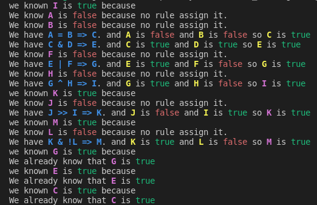

# expert-system
42 expert system in rust

An expert system in proposal calculation.    
In other words, a program that can reason on a set of rules and initial facts to deduce other facts. 
## Dependencies

The only dependencie you need is Rust.     
To get it, use `curl --proto '=https' --tlsv1.2 -sSf https://sh.rustup.rs | sh` or check [Rust web site](https://www.rust-lang.org/tools/install)
## Project

To start the project use:
 ```
 git clone https://github.com/glegendr/expert-system.git; cd expert-system; cargo run --release -- -i -t test_files/good/fritz_2.0.ru
```
## Flags
|shot|long|description|
|:-:|:-:|:-:|
|-h|--help|print helper|
|-i|--interactive|launch interactive mode|
|-t|--trace|display algorithm's trace|
|-v|--variables|display variables before running algorithm (no interactive)|
## Interactive mode
|command|argument|description|
|:-:|:-:|:-:|
|help|commands|display all commands or asked one|
|quit||quit the program|
|trace||unable/disable algorithm's trace|
|reset||clear the map and reload all providen files|
|variables||list all variables and their rules|
|rules||list all rules|
|clear||alias for "remove all"|
|file|path|read the file in path and enrich variables and rules|
|run|?variable|run the algorithm with variable if providen|
|remove all||clear all variables and rules|
|remove var|variable...|remove the variable and all rules implicated|
|remove rule|index|remove the rule depending the index listed with "rules"|
|remove ?|variable...|remove the variable from requested one|
|remove =|variable...|remove the variable from seted one|
|=|variable...|set the variable(s) to true|
|?|variabes...|set the variable(s) to requested|
|def|variable ?alias_true ?alias_false|create a new variable with name "variable"|
|if|rule|create a new rule|
## Exemple
Here is an example with algorithm's trace

## Authors
  <td align="center">
    <a href="https://github.com/lojesu/">
      
    </a>
  </td>
 <td align="center">
   <a href="https://github.com/glegendr/">
     
   </a>
  </td>
